# 📌 Projeto de Nivelamento NV1 — Backend Java

## 📖 Visão Geral

Este projeto consiste no desenvolvimento de uma **API RESTful** voltada para o **gerenciamento de reservas de salas**, permitindo que clientes realizem agendamentos de espaços para eventos de forma organizada, segura e eficiente.

A solução oferece recursos como:

- Cadastro e gerenciamento de usuários
- Registro e controle de salas disponíveis
- Criação, consulta e administração de reservas
- Cancelamento com regras de negócio
- Filtros e paginação nas consultas

---

## 🧾 Sumário

- [Tecnologias Utilizadas](#-tecnologias-utilizadas)
- [Arquitetura e Organização](#-arquitetura-e-organização)
- [Modelo de Dados](#-modelo-de-dados)
- [Endpoints Disponíveis](#-endpoints-disponíveis)
    - [Usuários](#-usuários)
    - [Salas](#-salas)
    - [Reservas](#-reservas)
- [Filtros de Reserva](#-filtros-de-reserva)
- [Exemplo de Cancelamento de Reserva](#-exemplo-de-cancelamento-de-reserva)
- [Como Executar com Docker Compose (Prod)](#-como-executar-com-docker-compose-prod)
- [Como Executar em Desenvolvimento (Dev)](#-como-executar-em-desenvolvimento-dev)
- [Executando Testes](#-executando-testes)
- [Aprendizados Obtidos](#-aprendizados-obtidos)

---

## 🚀 Tecnologias Utilizadas

- **Java 21**
- **Spring Boot 4.x**
- **Gradle**
- **Docker**
- **MariaDB**

---

## 🏗️ Arquitetura e Organização

O projeto segue uma estrutura inspirada no ecossistema Spring Boot, separando responsabilidades por camadas e organizando os recursos por contexto.

### 📌 `domain`
Camada responsável pelo núcleo da aplicação (entidades, regras de negócio, serviços, repositórios e mappers).

### 🌐 `web`
Camada de apresentação (controllers, DTOs, validações e handlers globais com `@RestControllerAdvice`).

### ⚙️ `config`
Pacote reservado para configurações futuras.

### ❗ `exceptions`
Exceções personalizadas utilizadas pela aplicação.

### 🌱 `seeders`
Geração de dados fictícios para facilitar desenvolvimento/testes manuais.

### 🧰 `utils`
Classes utilitárias de suporte geral.

---

## 🗂️ Modelo de Dados


---

# 📌 Endpoints Disponíveis

A API segue o padrão REST e está versionada em:

```
/api/v1
```

> **Paginação/ordenação (Spring Pageable)**: `page`, `size`, `sort` (ex.: `sort=dataInicio,desc`).

---

## 👤 Usuários

Base path:

```
/api/v1/usuarios
```

- `GET /api/v1/usuarios` — lista paginada
- `POST /api/v1/usuarios` — cadastra usuário
- `GET /api/v1/usuarios/{id}` — detalha usuário
- `PATCH /api/v1/usuarios/{id}` — atualiza usuário
- `DELETE /api/v1/usuarios/{id}` — remove usuário

---

## 🏢 Salas

Base path:

```
/api/v1/salas
```

- `GET /api/v1/salas` — lista paginada
- `POST /api/v1/salas` — cadastra sala
- `GET /api/v1/salas/{id}` — detalha sala
- `DELETE /api/v1/salas/{id}` — remove sala

---

## 📅 Reservas

Base path:

```
/api/v1/reservas
```

- `GET /api/v1/reservas` — lista paginada com filtros via query params
- `POST /api/v1/reservas` — cria reserva
- `GET /api/v1/reservas/{id}` — detalha reserva
- `PATCH /api/v1/reservas/{id}/cancelar` — cancela reserva
- `DELETE /api/v1/reservas/{id}` — remove reserva

---

## 🔎 Filtros de Reserva

O endpoint `GET /api/v1/reservas` aceita filtros via query params (opcionais):

| Parâmetro | Tipo | Descrição |
|---|---|---|
| `situacao` | `SituacaoReserva` | Situação atual da reserva (enum). |
| `usuarioId` | `Long` | Filtra reservas por usuário. |
| `salaId` | `Long` | Filtra reservas por sala. |
| `inicioDe` | `LocalDateTime` | Filtra reservas com `dataInicio >= inicioDe`. |
| `inicioAte` | `LocalDateTime` | Filtra reservas com `dataInicio <= inicioAte`. |

📌 **Formato de data/hora**: use ISO-8601, por exemplo: `2026-02-10T00:00:00`.

Exemplos:

```http
GET /api/v1/reservas?situacao=ATIVA
```

```http
GET /api/v1/reservas?usuarioId=10&salaId=2
```

```http
GET /api/v1/reservas?inicioDe=2026-02-10T00:00:00&inicioAte=2026-02-20T23:59:59
```

Com paginação/ordenação:

```http
GET /api/v1/reservas?size=20&page=0&sort=dataInicio,desc
```

---

## 📌 Fluxo de Criação de Reserva

A criação de uma reserva ocorre através do endpoint:

```http
POST /api/v1/reservas
```

---

### ✅ Dados Necessários

Para registrar uma reserva, o cliente deve enviar os seguintes campos no corpo da requisição:

| Campo        | Tipo            | Regras |
|-------------|----------------|--------|
| `sala`      | `Long`          | Obrigatório |
| `usuario`   | `Long`          | Obrigatório |
| `dataInicio`| `LocalDateTime` | Deve ser presente ou futura |
| `dataFim`   | `LocalDateTime` | Deve ser futura |

Exemplo de request:

```json
{
  "sala": 1,
  "usuario": 10,
  "dataInicio": "2026-02-10T10:00:00",
  "dataFim": "2026-02-10T12:00:00"
}
```

---

## 🔄 Diagrama de Sequência — Cadastro de Reserva

O diagrama abaixo representa o fluxo real implementado na aplicação para criação de uma reserva:

```mermaid
sequenceDiagram
    autonumber
    actor Cliente
    participant Controller as ReservaController
    participant Service as ReservaService
    participant Repo as ReservaRepository
    participant SalaSvc as SalaService
    participant UserSvc as UsuarioService
    participant Validators as IReservaValidator

    Cliente->>Controller: POST /api/v1/reservas\nbody: {sala, usuario, dataInicio, dataFim}

    Controller->>Controller: Validação DTO (@Valid)\nNotNull + Future/FutureOrPresent

    Controller->>Service: reservarSala(salaId, usuarioId, dataInicio, dataFim)

    Service->>Repo: buscarConflitosPorSalaOuUsuario(salaId, usuarioId, dataInicio, dataFim)

    Repo-->>Service: Reservas ATIVAS conflitantes

    alt Existe conflito
        Service-->>Controller: throw SalaJaReservadaException
        Controller-->>Cliente: 409 Conflict\n"Sala já reservada"
    else Sem conflito
        Service->>UserSvc: findById(usuarioId)
        UserSvc-->>Service: Usuario

        Service->>SalaSvc: findById(salaId)
        SalaSvc-->>Service: Sala

        Service->>Service: Criar Reserva.withId()\nsetUsuario, setSala, setDatas\nsituacao=ATIVA

        Service->>Validators: executar validações de negócio
        Validators-->>Service: OK

        Service->>Repo: save(reserva)
        Repo-->>Service: Reserva persistida

        Service-->>Controller: Reserva criada
        Controller-->>Cliente: 200 OK\nReservaInfoResponse
    end
```



---

## 🚫 Regra de Conflito de Agenda

Uma sala ou usuário não pode possuir reservas sobrepostas no mesmo intervalo de tempo.

A aplicação verifica conflitos com a seguinte regra:

- `dataInicio < dataFimNova`
- `dataFim > dataInicioNova`
- Reserva deve estar com situação **ATIVA**

Isso garante que não existam reservas concorrentes para o mesmo período.

----

## ✋ Exemplo de Cancelamento de Reserva

Endpoint:

```http
PATCH /api/v1/reservas/{id}/cancelar
```

Body:

```json
{
  "motivoCancelamento": "Cliente desistiu do evento"
}
```

Response (exemplo):

```json
{
  "id": "2b1c2f65-1c8f-4b14-a5d5-3cbbf4c1a9a9",
  "dataCancelamento": "06/02/2026 14:22",
  "motivoCancelamento": "Cliente desistiu do evento"
}
```

---

## 🐳 Como Executar com Docker Compose (Prod)

O projeto possui um `docker-compose.yaml` com dois serviços:

- **mariadb** (MariaDB 11) com healthcheck
- **alura-app** (API) rodando com profile `prod` e variáveis de ambiente para o datasource

Subir a stack:

```bash
docker compose up --build
```

A aplicação ficará disponível em:

- API: `http://localhost:8080`
- MariaDB (porta exposta): `localhost:3307` (mapeada para `3306` no container)

> Observação: no profile `prod`, as configs do datasource são lidas de `DATABASE_URL`, `DATABASE_USERNAME`, `DATABASE_PASSWORD`.

---

## 🛠️ Como Executar em Desenvolvimento (Dev)

No profile `dev`, o projeto utiliza integração do Spring com Docker Compose (arquivo `docker-compose-dev.yaml`) para iniciar o banco automaticamente.

Opções comuns:

### Rodar com profile dev

```bash
gradle bootRun --args='--spring.profiles.active=dev'
```

Ou configure `SPRING_PROFILES_ACTIVE=dev` no ambiente/IDE.

> No `dev`, o MariaDB normalmente fica em `jdbc:mariadb://localhost:3307/alura1`.

---

## 🧪 Executando Testes

```bash
gradle test
```

---

## 📚 Aprendizados Obtidos

- Construção de APIs REST com Spring Boot
- Modelagem relacional com JPA/Hibernate
- Validações com Bean Validation
- Filtros + paginação com `Pageable`
- Infra local com Docker Compose
- Uso de Criterias e Specifications
- Boas práticas de documentação e estruturação
- Construção de testes unitários com JUnit e Mockito

---

## ✅ Conclusão

Este projeto representa uma base sólida para aplicações backend modernas, servindo como exercício prático de arquitetura, organização e desenvolvimento com Java e Spring Boot.


## 💫 Futuro

*[ ] Terminar a documentação em Swagger (Tá bugando algumas coisas ainda)
*[ ] Implementar perfis de usuário (ADMIN, PREMIUM, ETC)
*[ ] Implementar autorização e autenticação
*[ ] Implementar um sistema simples com mensageria para notificação.
